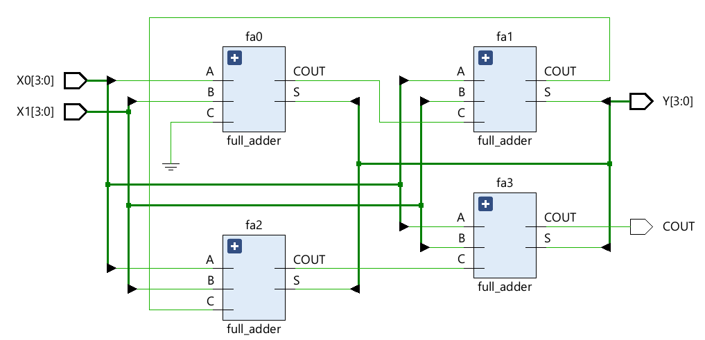
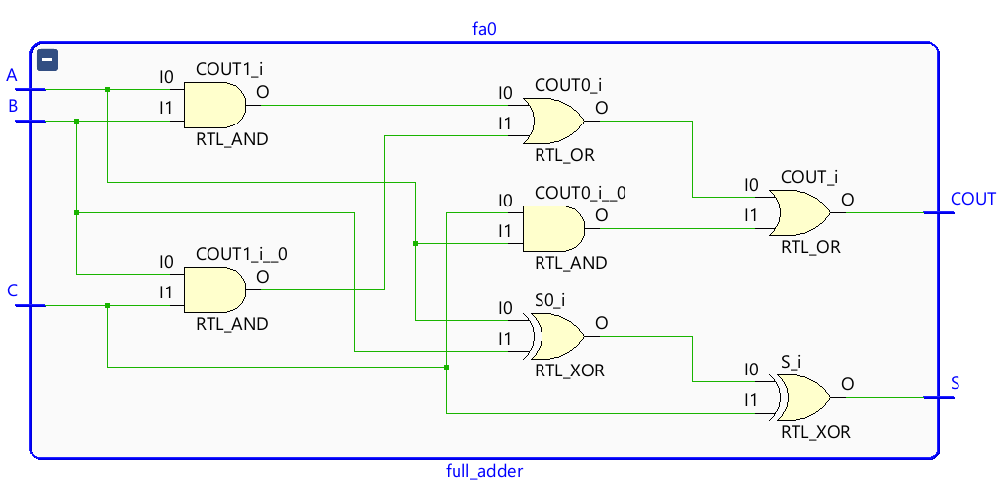
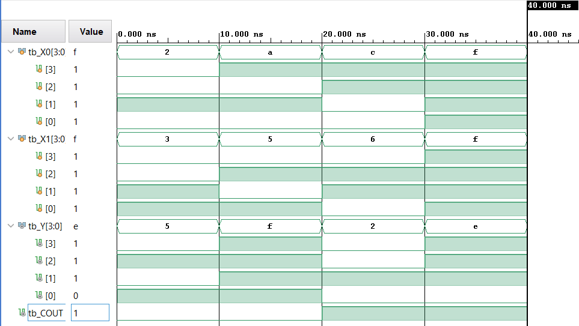

# 4-Bit Hierarchical Ripple Carry Adder (RCA) in Verilog

## 📌 Project Overview
This repository contains a fully synthesizable, gate-level optimized **4-Bit Ripple Carry Adder** designed using a structural, hierarchical hardware modeling methodology in Verilog HDL. The design has been fully compiled, synthesized, and structurally mapped using **AMD Xilinx Vivado**, and its operational correctness verified via a dedicated behavioral testbench sandbox.

By moving away from purely high-level behavior descriptions (like `+` operator assignments), this project models actual physical silicon logic—interconnecting four independent full-adder hardware primitives through an explicit internal carry propagation chain.

---

## ⚡ Key Architecture & Logic Foundations

The mathematical framework governing each individual structural bit slice (Full Adder Leaf Cell) is implemented using fundamental logic primitives:
* **Sum Bit ($S$):** $A \oplus B \oplus C_{in}$
* **Carry-Out ($C_{out}$):** $(A \cdot B) + (B \cdot C_{in}) + (C_{in} \cdot A)$

### Data Flow Optimization
* **Initial Stage Conditioning:** The Carry-In (`C`) pin for the Least Significant Bit (LSB) block (`fa0`) is hardwired directly to the digital ground plane (`1'b0`) to ensure a deterministic start without ghost floats.
* **The Ripple Propagation Chain:** The $C_{out}$ of each structural cell cascades directly into the $C_{in}$ node of the adjacent higher-order cell via internal interconnect wires (`c1`, `c2`, `c3`), accurately reflecting physical propagation delay boundaries.

---

## 🔬 Hardware Visualizations (Vivado RTL Analysis)

### 1. Top-Level Structural View (Hierarchical Canvas)
The top-level schematic illustrates the modular bus de-serialization, explicit port connections, and the foundational carry-propagation backbone interconnecting instances `fa0` through `fa3`.

### 2. Inner Gate Architecture (Leaf Cell Mapping)
Diving inside an individual hierarchical block reveals the synthesis-inferred primitive gate arrangement (`RTL_XOR`, `RTL_AND`, and `RTL_OR` trees) mapping boolean algebra seamlessly into structural hardware elements.

### 3. Behavioral Simulation Waveform
The functional timing diagrams generated in Vivado prove absolute computational accuracy under maximum capacity constraints (e.g., verifying boundary cases like overflow math).

---

## 🎓 Engineering Competencies Acquired

Through the end-to-end realization of this digital block, I have mastered several critical RTL core concepts:

* **Structural Module Instantiation:** Transitioned from software-style algorithmic scripting to genuine hardware building by instantiating standalone sub-modules and mapping their I/O ports.
* **Hierarchical Design Topologies:** Learned how to cleanly divide complex hardware into highly modular, testable, and reusable cell hierarchies.
* **Explicit Named Port Connections:** Utilized robust `.port_name(wire_name)` syntax over positional mapping, preventing cross-wire assembly faults.
* **Testbench Cradle Development:** Engineered a non-synthesizable simulation harness utilizing distinct variable mappings (`reg` arrays to drive input stimulus over a `#` timeline, and `wire` nodes to capture hardware response).
* **Automated Log Monitoring:** Used the `$monitor` system task inside an `initial` block environment to output automated state traces to the Tcl execution console.

---

